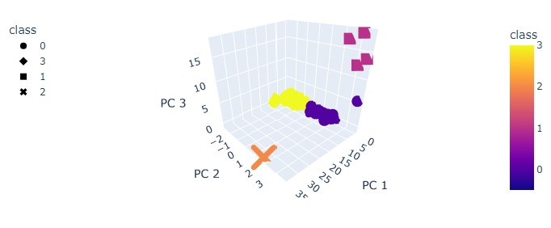
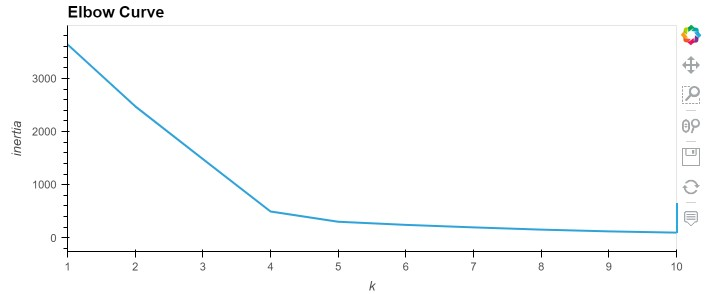
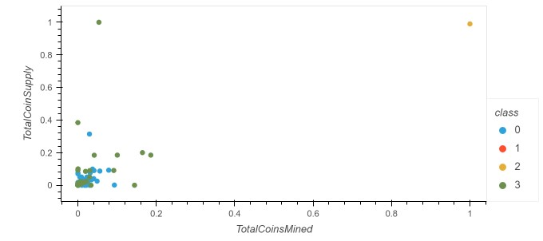
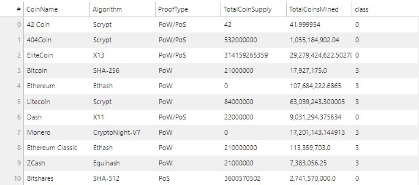

# Unsupervised Machine Learning and Cryptocurrencies

## Description
The goal of this project is to analyze a dataset of cryptocurrencies in any way that would discover trends that could help
convince stakeholders to invest in these new cryptocurrencies, at affordable prices. We dive deeper into machine learning using unsupervised algorithms, which help us explore data when we’re not sure what we’re looking for or without a clear output in mind,
we only use input data. We work primarily with the K-means algorithm, the main unsupervised algorithm that groups similar data into clusters. We build on this by speeding up the process using principal component analysis (PCA), which employs many different features.

### Challenge Overview
Use an algorithm that helps us discover patterns or groups. First, process the data for an unsupervised model, 
then use the clustering and K-means algorithm, and finally make the model more efficient by using principle component analysis.

### Approach
Prepared data for dimensions reduction with PCA and clustering using K-means. Then, reduced data dimensions using PCA algorithms from sklearn. Next, used the K-means algorithm form sklearn to Predict clusters using cryptocurrencies data. Finally, created some plots
and data tables to present results.

### Results

* 3D Scatter Plot

* Elbow Curve

* Clusters with Two Features

* Table with All the Tradable Cryptocurrencies 

### Things I Learned
* Describe the differences between supervised and unsupervised learning, including real-world examples of each.
* Preprocess data for unsupervised learning.
* Cluster data using the K-means algorithm.
* Determine the best amount of centroids for K-means using the elbow curve.
* Use PCA to limit features and speed up the model.

### Software/Tools
Python, Jupyter Notebook
